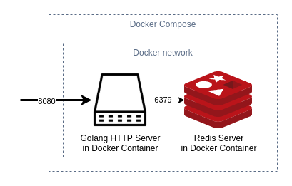

An HTTP API for creating and resolving shortened links.

Golang and Gin for the HTTP API, Redis for data cache.

Docker and Docker Compose to run instances.

Start API and Redis server. Exposes API on port 8080.
```
docker-compose up
```




1. Shorten URL, custom slug and expiration are optional.
```json
{
    "url": "https://test.com",
    "slug": "custom-url",
    "exp": 60
}
```
```json
{
    "url": "https://test.com"
}
```

2. Response
```json
{
    "slug":"custom-url or random slug"
}
```